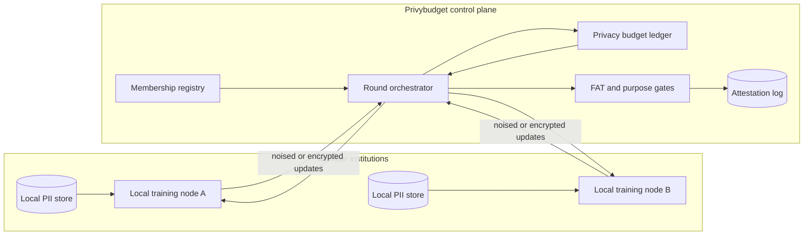

# Privybudget

**Source:** `ai-in-decentralized+ai/20181212queenslandaimeetup-181214004427/`
**Domain:** `ai-decentralized`
**One-liner:** A federated learning control plane that issues, meters, and audits differential-privacy budgets so hospitals and banks can train shared models without centralising raw patient or customer records.
**Wedge:** Multi-hospital clinical prediction consortia and bank fraud rings that already share threat intel but refuse a shared data lake — starting with one model family and a hard ε budget per member.
**Positioning:** Privacy-preserving ML operations, not another AutoML suite. The 2018 Queensland AI Meetup framed PySyft-style federated learning, secure multi-party computation, and differential privacy as the only credible path when data can be reverse-engineered from a trained model; G7 takeaways added “data trusts” and FAT ML as governance requirements. Privybudget turns those research primitives into a commercial privacy-budget ledger with human-gated releases.

## Market research synthesis

### Thesis from source

The meetup’s 2018 technical highlights treat privacy-preserving deep learning as a first-class infrastructure problem, not a research curiosity. PySyft is presented with an explicit goal: keep user data private and protect valuable commercial assets such as trained models. Federated learning moves the model to trusted systems where data already lives, but the deck warns that alone this is insufficient — training data can still be reverse-engineered from the model. The complementary controls named are secure multi-party computation (encrypted tensors trained across systems, including homomorphic operations) and differential privacy (noise and randomised identifiers so private identity information is not learned). Microsoft SEAL is cited as the encrypted-arithmetic substrate.

Alongside that technical stack, the societal and policy sections argue that trust is now the adoption constraint. FAT ML (fairness, accountability, transparency) is described as a radical shift away from “AI can magically fix everything,” after high-profile incidents such as biased recruitment and sentencing tools. The G7 multistakeholder conference takeaways ask how to improve diversity and access via an “AI + X” model and data trusts characterised as a “Switzerland for data,” how to build long-term trust via FAT ML, and how to regulate via industry standards. The Montreal Declaration adds privacy and intimacy, democratic participation, equity, and responsibility principles. Predictions for 2019 explicitly call out rising international tension over data use and the rise of distributed computing.

The commercially actionable gap is therefore not “more neural architecture search” (also covered in the deck) but an operating product that coordinates federated rounds, enforces a measurable privacy spend, and produces audit artefacts that a data-trust board or regulator can read. Deepfakes and media forensics appear in the deck as a parallel societal risk; Privybudget deliberately does not absorb that job — its beachhead is privacy-budgeted collaborative training.

### Buyer & economic model

- **Primary buyer:** Chief Data Protection Officer or Head of Clinical/Risk Analytics sponsoring a multi-institution model without creating a new central PII store.
- **Users:** federated learning engineers, privacy engineers, data custodians at each member institution, model validators, consortium administrators, external auditors.
- **Budget owner / value metric:** risk and compliance budget plus shared R&D pool; value metric is models shipped under an approved ε/δ spend without raw-data transfer incidents.
- **Competing status quo:** bilateral data-sharing agreements, de-identification spreadsheets, one-off research collaborations, or centralised “trusted research environments” that still concentrate liability in one host.

### Domain constraints

- **Regulatory / trust / safety:** GDPR-style purpose limitation and data minimisation; sector rules for health and financial data; FAT ML expectations from the source’s G7 framing; consortium members must retain unilateral kill-switches.
- **Data sensitivity:** raw records never leave member boundaries; only gradients, encrypted tensors, or DP-noised updates cross the wire; privacy budget is itself sensitive commercial and regulatory evidence.
- **Change-management realities:** members will not rewrite their ML stacks; Privybudget must wrap existing training jobs and run alongside institutional MLOps.

## Business requirements

- BR-1: No collaborative training round may start unless every participating member has an approved privacy budget allocation for that round.
- BR-2: The platform must meter differential-privacy spend (ε/δ or equivalent) per member, per model, and per purpose, and refuse jobs that would exceed remaining budget.
- BR-3: Raw training records must never be copied into a central store; only approved update artefacts (gradients, encrypted tensors, aggregates) may leave a member boundary.
- BR-4: Each completed round must emit an auditable attestation listing participants, purpose, budget consumed, and model artefact hash.
- BR-5: A member must be able to revoke participation mid-consortium without destroying historical attestations already issued.
- BR-6: Secure multi-party or encrypted-arithmetic modes must be selectable as policy, not as ad-hoc engineer preference.
- BR-7: Fairness and accountability checks defined by the consortium must gate model promotion from experimental to production use.
- BR-8: Privacy-budget reports must be exportable for a data-trust board or regulator without exposing underlying personal data.
- BR-9: Commercial terms must support cost-sharing of compute and coordination fees without requiring a speculative token.
- BR-10: Deepfake or media-forensics workflows are out of scope; the product must not claim to authenticate media artefacts.
- BR-11: Kill-switch: any member DPO can freeze outbound updates from their node within a published SLA.
- BR-12: Retention of attestations must cover the consortium’s contractual and regulatory dispute window.

## User stories

Canonical user stories live in sibling [USER_STORIES.md](USER_STORIES.md).

## System design

### Overview

Privybudget sits above member training runtimes as a coordination and policy plane. Institutions register nodes and datasets by reference (never by upload of raw PII). A consortium defines a model purpose, privacy parameters, and participation roster. When a round is proposed, the control plane checks remaining budgets, cryptographic mode, and consent/purpose bindings, then orchestrates local training steps and aggregates approved updates. Completed rounds write attestations to an append-only privacy ledger used for release gates and external audit.

### Actors & boundaries

- **Actors:** member institutions, privacy officers, ML engineers, validators, consortium operator, auditors, optional data-trust board.
- **Trust boundary:** raw data stays in member environments; Privybudget sees metadata, budgets, update artefacts, and attestations only.
- **Human-in-the-loop points:** budget allocation, purpose approval, fairness gate, emergency freeze, exception top-ups.

### Core capabilities

1. **Consortium and membership registry**
2. **Privacy budget ledger and metering**
3. **Federated round orchestration**
4. **SMPC / encrypted-arithmetic mode selection**
5. **Release attestation and FAT gates**
6. **Member kill-switch and revocation**
7. **Audit export for data-trust / regulator**

### Conceptual data

- **Primary entities:** Consortium, Member, Node, DatasetRef, PrivacyBudget, TrainingRound, UpdateArtefact, ModelCandidate, Attestation, FairnessGate, FreezeOrder.
- **Critical events:** budget allocated, round proposed, round blocked, update accepted, budget consumed, freeze issued, candidate promoted, attestation exported.
- **Retention / audit needs:** attestations and budget ledgers retained for the full regulatory window; update artefacts retained only as long as needed for verification then purged per policy.

### Integrations (conceptual)

- **Systems of record:** member EHR/core banking data platforms (read-local only), institutional MLOps, key management, IdP.
- **Upstream signals:** consent/purpose registries, institutional DPIA outcomes, FAT check suites.
- **Downstream actions:** model registry promotion, incident response tickets, board reporting packs.

### High-level architecture

### Success metrics

- **Leading:** share of proposed rounds that pass budget checks first time; median time from purpose approval to first completed round; freeze order acknowledgement latency.
- **Lagging:** number of models promoted under attested budgets; zero raw-data exfiltration incidents attributable to federation; audit findings closed without material privacy exceptions.

## OpenAPI skeleton

Canonical HTTP surface lives in sibling [openapi.yaml](openapi.yaml). Summary:

- **Base path:** `/v1/...`
- **Auth:** `X-API-Key` for member nodes; Bearer JWT for operators.
- **Resource groups:** Consortia, PrivacyBudgets, TrainingRounds, Attestations, Freezes.
