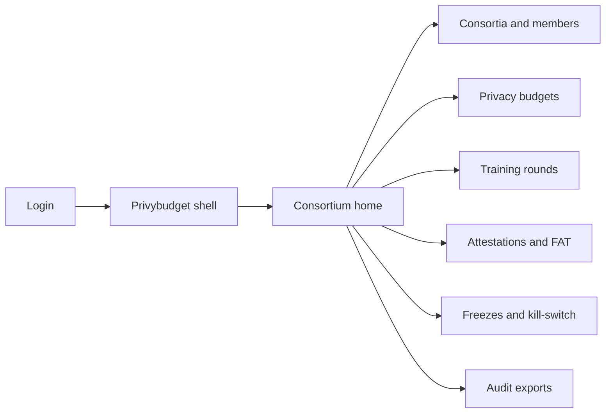
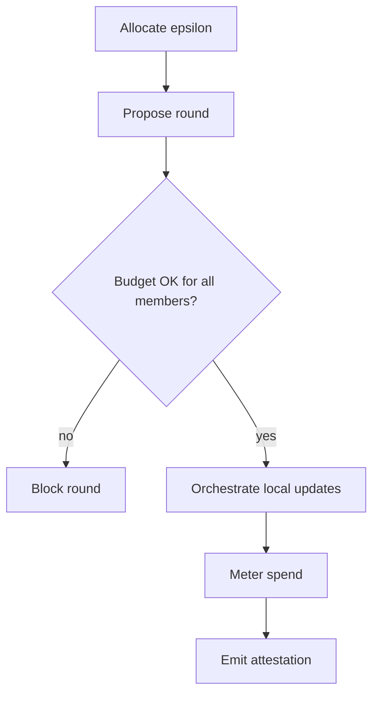

# Privybudget — Web app

**Product:** [PRODUCT.md](./PRODUCT.md)
**Primary surface:** Consortium privacy-ops console (budget ledger + round control plane)
**Secondary surfaces:** Member node status strip (read-only health); auditor export pack viewer (read-only attestation PDF/JSON)
**Design thesis:** Privybudget is a privacy-budget clearing house for federated rounds — the UI metaphor is an ε ledger and gated release desk, not an AutoML experiment board. Visual language is cool clinical teal on deep graphite: remaining budget feels like cash-on-hand; blocked rounds feel like a hard stop at the vault door. The wordmark sits as a quiet mint seal on every attestation-bearing screen so data-trust boards always know whose metering they are trusting.

## UX research synthesis

### Category peers (best-in-class)

- **Flower (Flower Intelligence / SuperLink console):** Federated run orchestration with client status and round timelines. Steal: round as the primary operating object with live member participation strips; reject generic ML experiment naming that hides privacy spend.
- **NVIDIA FLARE Dashboard:** Multi-site FL job visibility, site connectivity, and abort controls. Steal: per-site kill affordance and health without exposing local data; reject GPU-farm aesthetics that signal centralised training.
- **OpenMined / PySyft Network UX (researcher workflows):** Dataset-by-reference and remote computation mental model. Steal: “data never uploads” as a persistent chrome cue; reject research-notebook sprawl as the primary operator home.
- **Privitar / Immuta policy consoles:** Purpose-bound data access with measurable privacy controls. Steal: purpose + budget as first-class filters before any job runs; reject warehouse-catalog IA that assumes centralised PII.

### Patterns to adopt / reject

- **Adopt:** ε/δ remaining as the default KPI; round blocked state as first-class UI (not a toast); attestation hash + participant roster on every completed round; dual-control exception top-ups; freeze SLA countdown; FAT gate as a promotion lock.
- **Reject:** Model-accuracy-first dashboards that bury privacy spend; raw-record upload wizards; purple “AI insights” panels; chatbots as the budget allocator; speculative token wallets.

### Trust, density, and workflow constraints from PRODUCT.md

Operators need finance-grade density on privacy spend without exposing peer raw data or commercial model weights (BR-3, BR-8). Budget checks must block before compute wastes (BR-1, BR-2). Freeze must be unmistakable and fast (BR-11). Attestations are append-only evidence for boards and regulators (BR-4, BR-12). Fairness gates sit between experimental and production (BR-7). Members keep unilateral revocation without rewriting history (BR-5).

## Information architecture

### Nav model

### Roles → default home

| Role | Default home | Why |
|------|--------------|-----|
| Consortium privacy officer | Privacy budgets | Allocate and meter ε before rounds (BR-1, BR-2) |
| Member ML engineer | Training rounds | Launch only when budget remains |
| Data custodian | Freezes and kill-switch | Cap outbound exposure (BR-11) |
| Model validator / FAT reviewer | Attestations and FAT | Gate promotion (BR-7) |
| Platform administrator | Consortia and members | Node health and dual-control exceptions |
| External auditor / data-trust board | Audit exports | Read-only packs without PII (BR-8) |

### Cross-links to OpenAPI resources

| Nav area | OpenAPI tags / resources |
|----------|---------------------------|
| Consortia and members | Consortia |
| Privacy budgets | PrivacyBudgets |
| Training rounds | TrainingRounds |
| Attestations and FAT | Attestations |
| Freezes and kill-switch | Freezes |

## Screen inventory

### Consortium home

- **Purpose:** Answer “can we safely run the next collaborative round under remaining ε?” in one composition.
- **Entry:** Post-login for consortium roles; deep link from freeze or blocked-round alerts.
- **Layout regions:** Brand + consortium switcher; ε remaining vs allocated strip per purpose; active/blocked rounds table; node health strip; freeze and FAT alerts rail.
- **Primary actions:** Propose round; open budget; export latest attestation pack.
- **Empty / loading / error:** Empty = invite first member + allocate first budget; loading = skeleton KPIs; error = retry with request id.
- **BR / story ties:** BR-1, BR-2; privacy officer stories.

### Consortia and members

- **Purpose:** Register institutions, nodes, and dataset references without centralising PII.
- **Entry:** Nav → Consortia.
- **Layout regions:** Consortium list; member roster; node status; DatasetRef metadata (schema/purpose only); key/IdP binding status.
- **Primary actions:** Add member; register node; revoke membership (preserve attestations).
- **Empty / loading / error:** Empty = create consortium wizard; integration error on node heartbeat shown as blocking banner.
- **BR / story ties:** BR-3, BR-5; platform admin stories.

### Privacy budget ledger

- **Purpose:** Allocate and meter ε/δ per member, model, and purpose; refuse overspend.
- **Entry:** Nav → Privacy budgets; home KPI drill-down.
- **Layout regions:** Ledger table (allocated, consumed, remaining, purpose); allocation form with dual-control for exceptions; projected spend for proposed round.
- **Primary actions:** Allocate; request exception top-up; export board report.
- **Empty / loading / error:** Empty = set first purpose budget; overspend attempt = hard block with remaining shown.
- **BR / story ties:** BR-1, BR-2, BR-8, BR-9.

### Training round orchestrator

- **Purpose:** Propose and run federated rounds only when every participant has approved budget and mode policy.
- **Entry:** Nav → Training rounds; home CTA.
- **Layout regions:** Round queue (proposed / running / blocked / complete); participant checklist; cryptographic mode (DP / SMPC / encrypted-arithmetic) with performance callout; update artefact log (hashes only).
- **Primary actions:** Propose round; cancel; open attestation on complete.
- **Empty / loading / error:** Blocked = missing budget or freeze highlighted; empty = register job from existing MLOps.
- **BR / story ties:** BR-1, BR-3, BR-6; ML engineer stories.

### Attestations and FAT gates

- **Purpose:** Emit release attestations and require fairness/accountability checks before promotion.
- **Entry:** Round complete; nav → Attestations.
- **Layout regions:** Attestation list (participants, purpose, ε consumed, model hash); FAT checklist; promote/reject panel; purpose-mismatch warning.
- **Primary actions:** Run FAT suite; promote candidate; reject with reason; export pack.
- **Empty / loading / error:** Empty = no completed rounds; FAT fail = promotion locked.
- **BR / story ties:** BR-4, BR-7; validator stories.

### Freezes and kill-switch

- **Purpose:** Let any member DPO freeze outbound updates within published SLA.
- **Entry:** Custodian default; alerts; nav → Freezes.
- **Layout regions:** Active freezes; SLA countdown; affected rounds; acknowledge/release with reason codes.
- **Primary actions:** Issue freeze; acknowledge; schedule release with dual control.
- **Empty / loading / error:** Empty = healthy “no active freezes” with last drill time; SLA breach = coral blocking state.
- **BR / story ties:** BR-5, BR-11.

### Audit export viewer

- **Purpose:** Deliver board/regulator packs without underlying personal data.
- **Entry:** Privacy officer or auditor role.
- **Layout regions:** Pack builder (period, consortia, purposes); preview of attestations and budget ledger slices; download controls.
- **Primary actions:** Generate pack; verify hash; share link with expiry.
- **Empty / loading / error:** Empty period = no attestations message; generation failure with retry.
- **BR / story ties:** BR-8, BR-12.

### Exception dual-control queue

- **Purpose:** Emergency budget top-ups cannot be unilateral.
- **Entry:** From budget ledger exception request; admin queue.
- **Layout regions:** Pending requests; requester vs approver panes; audit trail.
- **Primary actions:** Approve; deny; request more DPIA evidence.
- **Empty / loading / error:** Empty = no pending exceptions.
- **BR / story ties:** Platform administrator dual-control story; BR-2 adjacency.

## Key flows

1. **Allocate then train** — set purpose budget → register nodes → propose round → budget check → orchestrate → consume ε → attest; failure: insufficient budget blocks start (BR-1, BR-2).

2. **Promote under FAT** — completed round → attestation → FAT checks → purpose match → promote or reject (BR-4, BR-7).

3. **Member kill-switch** — suspected incident → freeze outbound → rounds pause for that member → acknowledge within SLA → optional revoke without destroying history (BR-5, BR-11).

4. **Board export** — select window → assemble budget + attestation pack → hash verify → download without PII (BR-8).

5. **Exception top-up** — request extra ε → second approver → ledger append → unblock queued round.

## Design system

### Tokens (CSS variables)

- `--color-ink: #E6EEF2` — primary text on dark ground
- `--color-graphite-950: #0A1218` — app ground
- `--color-graphite-900: #121A22` — panels
- `--color-graphite-700: #2A3844` — rules
- `--color-teal: #2EC4B6` — remaining budget / verified attestation
- `--color-teal-dim: #1A6B63` — teal on dark
- `--color-amber: #E0A100` — provisional / pending dual-control
- `--color-coral: #E85D4C` — freeze / blocked round
- `--color-steel: #7A93A6` — secondary labels
- `--color-brand: #8FD4CC` — Privybudget wordmark accent
- `--font-display: "IBM Plex Sans", sans-serif`
- `--font-mono: "IBM Plex Mono", monospace` — ε figures, hashes, attestation ids
- `--space-1`…`--space-8`: 4px scale
- `--radius-sm: 4px`; `--radius-md: 8px`
- `--motion-meter: 200ms ease-out` — budget consume flash
- `--motion-freeze: 280ms ease-in-out` — freeze banner entrance
- `--motion-attest: 160ms ease-out` — attestation lock settle
- Atmosphere: subtle vertical “vault bar” texture in graphite-900; cool teal edge glow only on attested rows — no stock hospital photography in console.

### Typography & brand

- Display for ε numerals and screen titles; mono for hashes, node ids, attestation ids.
- Brand wordmark left of shell on every budget- and attestation-bearing view.
- Login shell: brand as hero; one headline (“Train under a measured ε”); one CTA — no vanity accuracy tiles.

### Do / don’t

- **Do:** Show remaining ε before launch; treat attestations as locked; dual-pane for exception approval; persistent “raw data stays local” cue.
- **Don’t:** Purple AI glow; upload-PII wizards; accuracy-only home; card grids for static metrics; token/crypto wallet chrome (BR-9).

### Accessibility & domain trust cues

- Contrast AA+ on teal/amber/coral against graphite; freeze also uses lock + text, not colour alone.
- Live regions announce freeze issuance and round blocked events.
- Focus order follows policy flow: budget → round → attestation → export.

## Component patterns

- **EpsilonLedgerRow** — allocated / consumed / remaining with purpose binding.
- **RoundBlockBanner** — hard stop when budget or freeze prevents start.
- **AttestationSeal** — participants + ε spent + model hash + lock state.
- **FatGateChecklist** — promotion lock until checks pass.
- **FreezeSlaChip** — countdown to acknowledgement SLA.
- **DatasetRefCard** — reference-only metadata; no raw preview.
- **DualControlQueueItem** — requester/approver split for top-ups.
- **AuditPackExport** — board-safe attestation + budget slice.

## Out of scope for v1 web

- Deepfake / media-forensics tools (BR-10); AutoML architecture search studio; central trusted research environment that hosts raw PII; consumer patient portals; native mobile trader apps; speculative token settlement UI.
